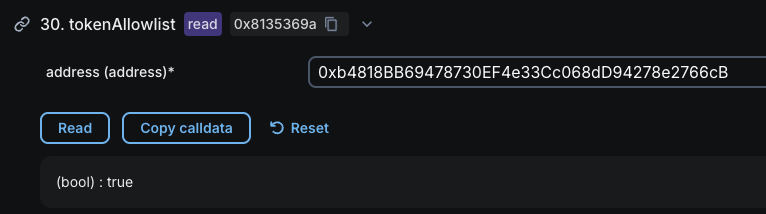

# Adding a New Token to Staking

The goal of this guide is to walk you through the steps needed to add a new token to the staking list.

## Before you begin

You need to add the new token to the [hemilabs/token-list](https://github.com/hemilabs/token-list) repository before adding the token to stake here. You can follow this [tutorial](https://github.com/hemilabs/token-list/blob/master/docs/add-new-token.md) to do that.

Proceed with this tutorial only when the token is available in a released version of [hemilabs/token-list](https://github.com/hemilabs/token-list/releases) npm package.

## Step 1 - Bump the Token List package version

Update the [hemilabs/token-list](https://github.com/hemilabs/token-list) package version in `webapp/package.json` file for the version that have the token you want to add to stake.

```jsonc
"dependencies": {
    ...
-   "@hemilabs/token-list": "1.15.0",
+   "@hemilabs/token-list": "1.16.0",
    ...
}
```

## Step 2 - Add the token to stakeTokens file

Add the new token to the [stakeTokens.ts](../tokenList/stakeTokens.ts) file in the `stakeWhiteList` object and under the appropriate chain id (mainnet or testnet) as shown below:

```ts
// webapp/tokenList/stakeTokens.ts

export const stakeWhiteList: Partial<
  Record<Token['chainId'], Record<string, StakeExtensions>>
> = {
    [hemi.id]: {
        ...
        // satUSD
        '0xb4818BB69478730EF4e33Cc068dD94278e2766cB': {
            protocol: 'satoshi',
            priceSymbol: 'usdc',
            rewards: ['hemi3x', 'satoshi', 'pell'],
            website: 'https://www.satoshiprotocol.org',
        },
        ...
    },
    ...
}
```

## Step 3 - Add the protocol logo image (if needed)

If the new token protocol is not already in the [protocolImages.ts](../app/[locale]/stake/protocols/protocolImages.ts) file you need to add the protocol logo image to the [/stake/protocols/images](../app/[locale]/stake/protocols/images) folder and add it to the `protocolImages` list as below:

```ts
// webapp/app/[locale]/stake/protocols/protocolImages.ts

import satoshi from './images/satoshi.png'

...

export const protocolImages: Record<StakeProtocols, StaticImageData> = {
    ...
    satoshi,
    ...
}
```

## Step 4 - Add the new rewards icon images (if needed)

If the new token you added have rewards that are not already in the [tokenRewards.tsx](../app/[locale]/stake/_components/tokenRewards.tsx) list you must add the icon image file to the [rewards icons](../app/[locale]/stake/_components/icons) folder and create the reward points tag component as follows:

```ts
// webapp/app/[locale]/stake/_components/pointsTag.tsx

import { SatoshiPointsIcon } from './icons/satoshiPointsIcon'

...

export const SatoshiPoints = () => (
  <PointsTag
    backgroundColor="bg-black"
    icon={<SatoshiPointsIcon />}
    label="points"
    textColor="text-white"
  />
)
```

After that you just need to add the reward points tag component to the [tokenRewards.tsx](../app/[locale]/stake/_components/tokenRewards.tsx) list:

```ts
// webapp/app/[locale]/stake/_components/tokenRewards.tsx

import {
  ...
  SatoshiPoints,
  ...
} from './pointsTag'

const rewardComponentMap: Record<Reward, ReactNode> = {
  ...
  satoshi: <SatoshiPoints />,
  ...
}
```

## Step 5 - Check if token is whitelisted

Before merging your changes to the `main` branch you need to make sure the new token you added is already whitelisted to staking and you can do that by calling `tokenAllowlist` method in the [staking pool smart contract](https://explorer.hemi.xyz/address/0x4F5E928763CBFaF5fFD8907ebbB0DAbd5f78bA83) as shown in the screenshot below:



If the answer is `true` you can proceed and merge your changes to the main branch and the token will be available to stake.
